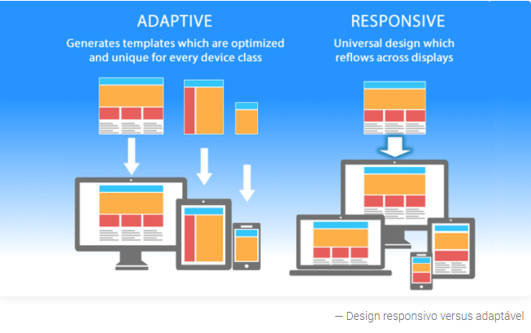

## Qual a diferenca de designer adaptativo para desing responsivo?

- Responsivo - ele se adapta a renderização da página. \
- Adaptativo - Fornece versões diferentes de uma mesma página\
  \
  

Com design responsivo, os usuários acessarão o mesmo arquivo básico através de seu navegador, independentemente do dispositivo, mas o código CSS controlará o layout e o renderizará de forma diferente com base no tamanho da tela.\
\
Com design adaptável, há um script que verifica o tamanho da tela, e depois acessa o modelo projetado para aquele dispositivo.

## Porque e a responsividade e importante?
Cerca de 51% to tráfego web e constiutido pelo web mobile. Ou sejá mais da metade de potenciais usuários usam dispositivos móveis para navegar na internet.\
\
não inibindo fato que ainda temos 49% de potenciais usuários que acessam mecanismos de busca atraves do browser! 


## Breake Points - resoluções de tela 

Geralmente em empresas já existe um setor que realiza uma pesquisa para saber quais tipos de mídia o usuário final consome o seu conteúdo!

Mas ai você se pergunta como eu vou saber qual tamanho de tela eu posso projetar existe um padrão que eu posso seguir?

Por existir milhares de dispositivos no mercado com tamanhos e resoluções diferentes e afins nos não podemos dizer que existe um padrão, mas existe alguns breakpoints que são usados no mundo da programação que você pode usar como base e são eles:

 - 320px — 480px: dispositivos móveis
 - 481px — 768px: iPads, tablets
 - 769px — 1024px: telas pequenas, laptops
 - 1025px — 1200px: desktops, telas grandes
 - 1201px > acima —  telas muito grandes, TVs


Mas como já explicado não existe um padrão com exatidão!


## OKAY! Mas como é que eu deixo meu projeto responsivo na prática? 

Como já deve estar subentendido nós trabalhamos a responsividade através do Css de nosso projeto.

#### Mas como fazemos isso? 
Dois elementos que podem nos ajudar muito a trabalhar a responsividade dos nossos sites são:
 - As media querys.
 - Layout Flexbox ou grid

### O que é uma media query?

Media query é um recurso do CSS3 que nos auxilia a com a adaptacao do layout da página em diferentes tipos de tela!

### Sintaxe 
 
 A sintaxe é iniciada com o  **@media** >  seguido do **tipo de mídia de destino** >  **and** > e entre parenteses a **condição e o breakpoint**.\
 \
 Como indicado no código abaixo:

```css
@media tipo de mídia and (condição: breakpoint) {
  // regras de CSS
}
```

Calma não precisa pirar vamos passar em cada um dos elementos para que você possa compreender melhor a sintaxe, sabemos que no começo ela pode parecer um pouco complicada! 

Nos comecamos sempre definindo a regra do **@media**  e depois incluimos  as chaves que será escrita as regras do css.

```css
@media {
  // regras de CSS
}
```

Em seguida nós podemos indicar qual o tipo de media que vamos utilizar. 

Se não indicarmos qual tipo de media nos vamos usar a **@media** escolhe todos os dispositivos por padrão!

Ao contrario do breakpoints o tipos de midia podem se enquadrar em 4 categorias são elas 
 - **all** : para todos os tipos de media
 - **print** : para impressoras
 - **screen** : para telas de computador, tablets e smartphones
 - **speech** : para leitores de tela, audio visuais.

Então por exemplo eu desejo usar apenas as telas, eu vou usar a palavra chave **screen** e tambem concatenar a palavra chave **and**: 


 ```css
@media screen and ( max-whidth: 480px ) {
  // Regras do css
}
``` 
 .

Agora nós indicamos qual a condição e o breakpoint.
 - **Condicão** - A condição seria a comparacao da largura de um dispositivo. Um exemplo:

  ```css

 .background{
    background-color: gray;
 }
 

@media screen and ( max-whidth: 480px ) {
   .background {
     background-color: yellow;
   }
}
```

Quando o meu dispositivo chegar a largura máxima de 480px, ele irá mudar o background para amarelo

### Importante 
 - Ele so vai "executar" o que tiver dentro do {} da media query.
 - A sua media query deve ficar sempre no final do seu css!


