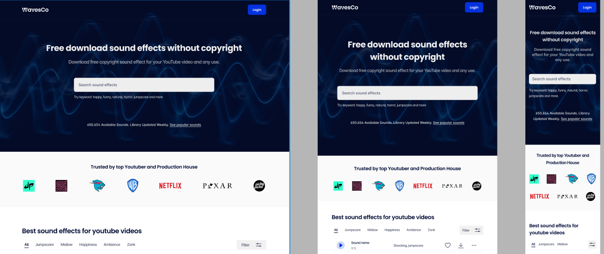

# Media query

## O que é ?
Media query é um recurso do CSS3 que nos auxilia a com a adaptacao do layout da página em diferentes tipos de tela!

### Sintaxe 
 
 A sintaxe é iniciada com o  **@media** >  seguido do **tipo de mídia de destino** >  **and** > e entre parenteses a **condição e o breakpoint**.\
 \
 Como indicado no código abaixo:

```css
@media tipo de mídia and (condição: breakpoint) {
  // regras de CSS
}
```

Calma não precisa pirar vamos passar em cada um dos elementos para que você possa compreender melhor a sintaxe, sabemos que no começo ela pode parecer um pouco complicada! 

Nos comecamos sempre definindo a regra do **@media**  e depois incluimos  as chaves que será escrita as regras do css.

```css
@media {
  // regras de CSS
}
```

Em seguida nós podemos indicar qual o tipo de media que vamos utilizar. 

Se não indicarmos qual tipo de media nos vamos usar a **@media** escolhe todos os dispositivos por padrão!

Ao contrario do breakpoints o tipos de midia podem se enquadrar em 4 categorias são elas 
 - **all** : para todos os tipos de media
 - **print** : para impressoras
 - **screen** : para telas de computador, tablets e smartphones
 - **speech** : para leitores de tela, audio visuais.

Então por exemplo eu desejo usar apenas as telas, eu vou usar a palavra chave **screen** e tambem concatenar a palavra chave **and**: 


 ```css
@media screen and ( max-whidth: 480px ) {
  // Regras do css
}
``` 
 .

Agora nós indicamos qual a condição e o breakpoint.
 - **Condicão** - A condição seria a comparacao da largura de um dispositivo. Um exemplo:

  ```css

 .background{
    background-color: gray;
 }
 

@media screen and ( max-whidth: 480px ) {
   .background {
     background-color: yellow;
   }
}
```

Quando o meu dispositivo chegar a largura máxima de 480px, ele irá mudar o background para amarelo

### Importante 
 - Ele so vai "executar" o que tiver dentro do {} da media query.
 - A sua media query deve ficar sempre no final do seu css!


## DESAFIO 
Tente reproduzir esse [frame](https://www.figma.com/file/CSySCaphNRyX8K99RJgLbX/Sounds-effect-library---responsive-landing-page-(Community)?node-id=0%3A1) 



Projeto criado por [@bdyhm](https://www.figma.com/@bdyhm)