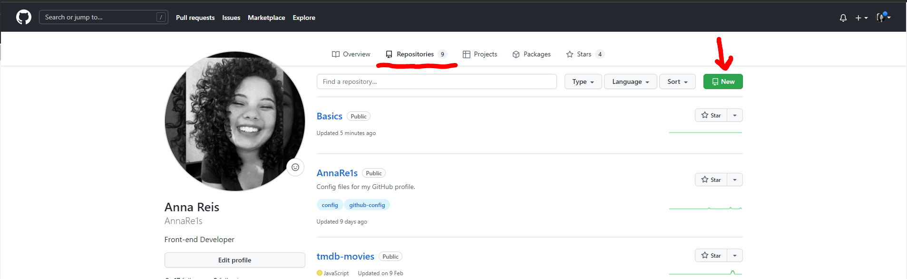
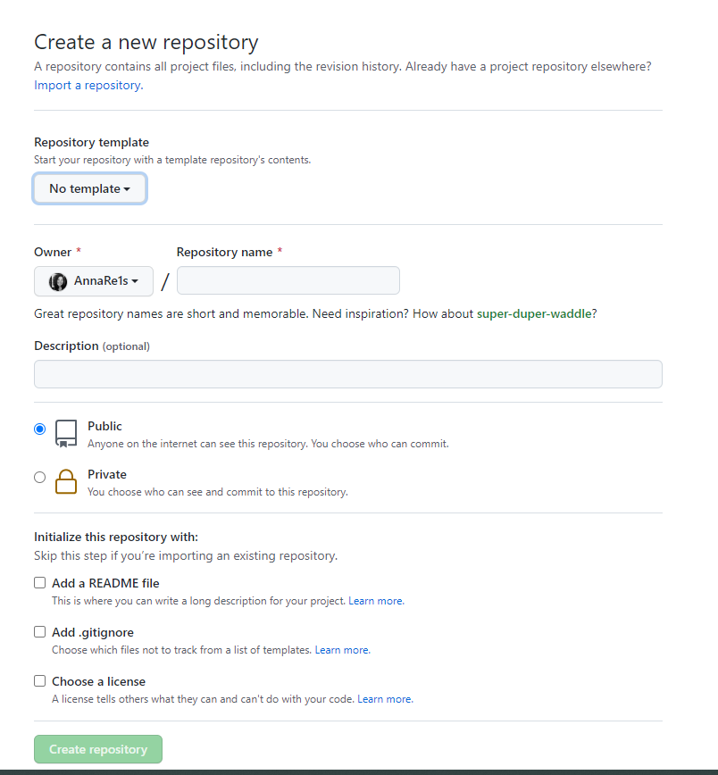
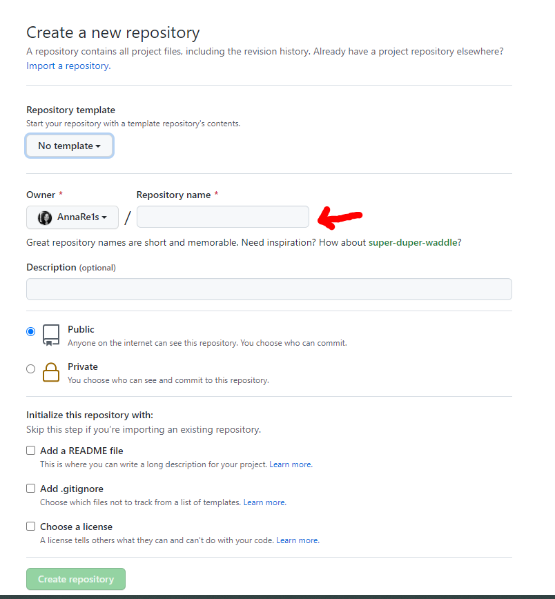
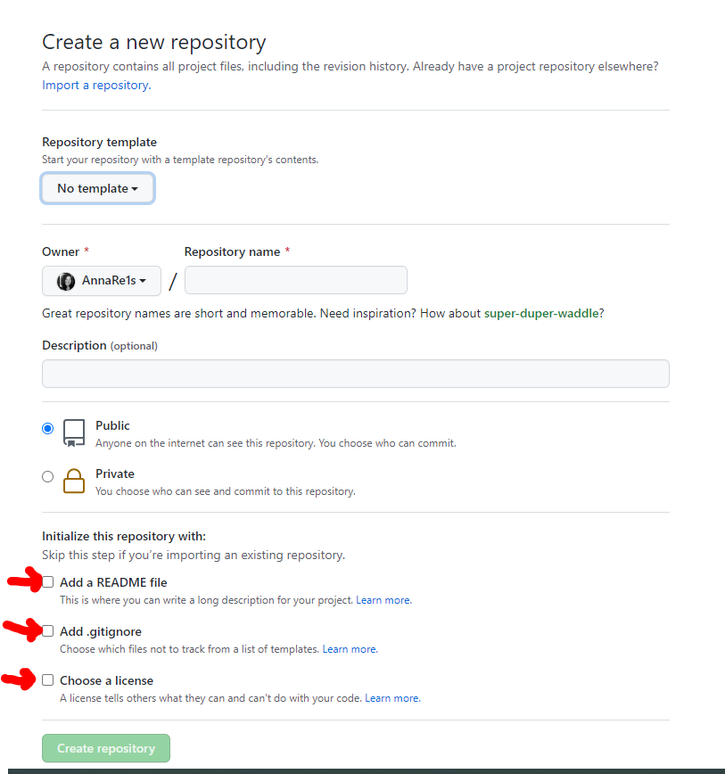
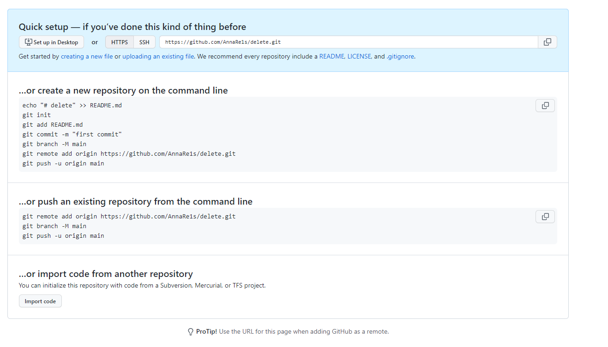

# Repositório remoto 
Aqui vamos explorar como criar um novo repositório no github


No seu repositório github na aba repositório clique em new


Logo após você será direcionado para a pagina de criação do um novo repositório 


Nesta página no campo **repository name** você pode indicao o nome que você deseja que seu repositorio tenha. 



- A descrição não e obrigatória mas pode preencher escrevendo sobre o intuito do projeto.
-  Você pode deixar o seu projeto visivel ao publico ou em modo privado 


##

Os campos indicados a baixo fica a sua disposicao aciona-los ou não caso acione o seu repositorio remoto automaticamente ira criar ja um repositorio correspondente



Apos os campos preenchidos proceguir clicando em Create new repository.

Você será levado para a seguinte pagina.




## Conectando repositório local com o repositório remoto

No seu terminal ja dentro do repositorio que você queira vincular ao repositório remoto você seguira os passos abaixo

#### Passo 1
```sh
$ git init 
```

#### Passo 2
```sh
$ git remote add origin https seu QuickSetup
```
ou você pode copiar e colar essa linha de comando indicada na imagem abaixo 


#### Passo 3
```sh
$ git branch -M main
```

Caso você não tenha nenhum aquivo ou repositório para ser commitado conclua com o passo 4

#### Passo 4
```sh
$ git push -u origin main
```


## Contribuições 

Fique a vontade para contribuir basta realizar um fork e solicitar um pull request 