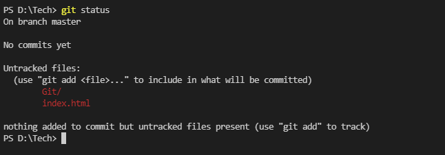
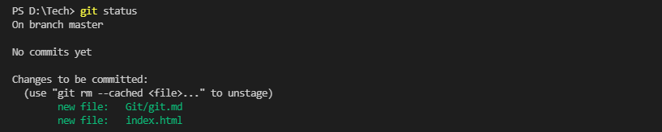

# GIT 

####  Qual a diferença entre git e gitHub ❓
 **Git** é um sistema de versionamento de arquivos que você instala na sua maquina. 
 **GitHub** e uma plataforma que você usa para hospedar esses projetos que pode conter esse controle de versionamento. 
 

## Git**❓**

O Git é um projeto de código aberto, desenvolvido em 2005 por Linus Torvalds, criador do kernel do sistema operacional Linux.

Agora que o git e um sistema de versionamento ja sabemos agora como e que ele funciona na pratica e porque eu quero ter esse cara instalado no meu pc?
Vamos dizer que você esta criando um projeto x,  após você finalizar o projeto o cliente pede uma alteração , duas, três , quatro. Imagina ficar com esse mundo de arquivo salvo no seu computador, para esses e outros casos que serve o git! Esse software ele serve para criar e armazenar essas versões de projeto dentro do seu computador e caso seja necessário retornar para um dos projetos anteriores o git te ajuda a retornar em uma dessas versões de maneira mais fácil.

> _Tendo uma arquitetura distribuída, o Git é um exemplo de DVCS (portanto, Sistema de Controle de Versão Distribuído). Em vez de ter apenas um único local para o histórico completo da versão do software, como é comum em sistemas de controle de versão outrora populares como CVS ou Subversion (também conhecido como SVN), no Git, a cópia de trabalho de todo desenvolvedor do código também é um repositório que pode conter o histórico completo de todas as alterações. -_ Atlassian Bitbucket

##

## Configurações 
As configurações do GIT são armazenadas no arquivo **.gitconfig** localizado dentro do diretório do usuário do Sistema Operacional (Ex.: Windows: C:\Users\Anna)

As configurações realizadas através dos comandos abaixo serão incluídas no arquivo citado acima.

### Configuração principais

####  Setar  Usuário
```sh
$ git config --global user.name "Seu nome"
```

####  Setar  E-mail
```sh
$ git config --global user.email seu@email.com
```
#### Setar arquivos a serem ignorados
```sh
$ git config --global core.excludesfile ~/.gitignore
```
Os nomes de arquivos/diretórios ou extensões de arquivos listados no arquivo  **.gitignore**  não serão adicionados em um repositório. 

As demais configurações podemos ver atraves do comando 
```sh
$ git config --list
```
##

## Comandos Git repositório local

#### Criar novo um novo repositório 
```sh
$ git init
```

#### Verificar estado dos diretórios ou arquivos  
```sh
$ git status 
```

Quando apresenta-se em vermelho os repositorios nao foram adicionados para fazer um commit.


Quando verde esta adicionado e pronto para ser commitado


####  Adicionar diretório (staged area)  

##### Adicionar todos os arquivos 
```sh
$ git add . 
```
##### Adicionar um diretório específico
```sh
$ git add meu_diretorio
```
##### Adicionar um arquivo específico
```sh
$ git add meu_arquivo.txt
```
####  Commitar um Diretório

##### Comitar todas as alterações informando mensagem
```sh
$ git commit -m "minha mensagem de commit"
```
##### Comitar arquivo especifico informando mensagem 
```sh
$ git commit meuarquivo.txt -m "minha mensagem de commit"
```
#### Remover arquivo ou diretório
##### Remover arquivo
```sh
$ git rm meu_arquivo.txt
```
##### Remover diretório
```sh
$ git rm -r diretorio
```
## Comandos Repositório Remoto


#### Exibir os repositórios remotos
```sh
$ git remote
$ git remote -v
```

#### Vincular repositório local com um repositório remoto
```sh
$ git remote add origin git@github.com:leocomelli/curso-git.git
```

#### Renomear um repositório remoto
```sh
$ git remote rename origin curso-git
```

#### Desvincular um repositório remoto
```sh
$ git remote rm curso-git
```
##

### Enviar arquivos/diretórios para o repositório remoto

O primeiro  **push**  de um repositório deve conter o nome do repositório remoto e o branch.

```sh
$ git push -u origin nome da sua branch
```
##

### Atualizar repositório local de acordo com o repositório remoto

#### Atualizar os arquivos no branch atual de acordo com o repositório remoto
``` sh
$ git pull origin nome do branch
```
##### Buscar as alterações, mas não aplica-las no branch atual
```sh
$ git fetch
```

##

### Clonar um repositório remoto já existente
```sh
$ git clone git@github.com:leocomelli/curso-git.git
```

##	Branchs
##### Criar um branch repositório local
```sh
$ git checkout -b "nome da branch"
```
##### Apagar uma branch
```sh
$ git branch -d nome da branch
```
##### Listar branches
```sh
$ git branch
```
###### Listar branches com informações dos últimos commits
```sh 
$ git branch -v
```


